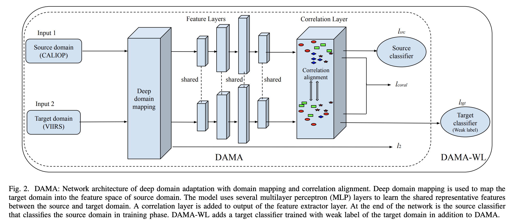
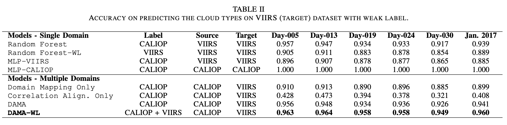

## Notices:

“Copyright © 2022 United States Government as represented by the Administrator of the National Aeronautics and Space Administration.   All Rights Reserved.”


### Disclaimer:

No Warranty: THE SUBJECT SOFTWARE IS PROVIDED "AS IS" WITHOUT ANY WARRANTY OF ANY KIND, EITHER EXPRESSED, IMPLIED, OR STATUTORY, INCLUDING, BUT NOT LIMITED TO, ANY WARRANTY THAT THE SUBJECT SOFTWARE WILL CONFORM TO SPECIFICATIONS, ANY IMPLIED WARRANTIES OF MERCHANTABILITY, FITNESS FOR A PARTICULAR PURPOSE, OR FREEDOM FROM INFRINGEMENT, ANY WARRANTY THAT THE SUBJECT SOFTWARE WILL BE ERROR FREE, OR ANY WARRANTY THAT DOCUMENTATION, IF PROVIDED, WILL CONFORM TO THE SUBJECT SOFTWARE. THIS AGREEMENT DOES NOT, IN ANY MANNER, CONSTITUTE AN ENDORSEMENT BY GOVERNMENT AGENCY OR ANY PRIOR RECIPIENT OF ANY RESULTS, RESULTING DESIGNS, HARDWARE, SOFTWARE PRODUCTS OR ANY OTHER APPLICATIONS RESULTING FROM USE OF THE SUBJECT SOFTWARE.  FURTHER, GOVERNMENT AGENCY DISCLAIMS ALL WARRANTIES AND LIABILITIES REGARDING THIRD-PARTY SOFTWARE, IF PRESENT IN THE ORIGINAL SOFTWARE, AND DISTRIBUTES IT "AS IS."

Waiver and Indemnity:  RECIPIENT AGREES TO WAIVE ANY AND ALL CLAIMS AGAINST THE UNITED STATES GOVERNMENT, ITS CONTRACTORS AND SUBCONTRACTORS, AS WELL AS ANY PRIOR RECIPIENT.  IF RECIPIENT'S USE OF THE SUBJECT SOFTWARE RESULTS IN ANY LIABILITIES, DEMANDS, DAMAGES, EXPENSES OR LOSSES ARISING FROM SUCH USE, INCLUDING ANY DAMAGES FROM PRODUCTS BASED ON, OR RESULTING FROM, RECIPIENT'S USE OF THE SUBJECT SOFTWARE, RECIPIENT SHALL INDEMNIFY AND HOLD HARMLESS THE UNITED STATES GOVERNMENT, ITS CONTRACTORS AND SUBCONTRACTORS, AS WELL AS ANY PRIOR RECIPIENT, TO THE EXTENT PERMITTED BY LAW.  RECIPIENT'S SOLE REMEDY FOR ANY SUCH MATTER SHALL BE THE IMMEDIATE, UNILATERAL TERMINATION OF THIS AGREEMENT.


# Cloud Phase Prediction with Multi-Sensor Domain Adaptation 
This repository provides an end-to-end deep domain adaptation with domain mapping and correlation alignment (DAMA) and apply it to classify the heterogeneous remote satellite cloud and aerosol types.

## Prerequisite
The project currently supports `python>=3.7`

### Install dependencies
```
>> conda create -n cloud-phase-prediction-env -c conda-forge python=3.7 pytorch h5py pyhdf
>> conda activate cloud-phase-prediction-env
>> git clone https://github.com/AI-4-atmosphere-remote-sensing/cloud-phase-prediction
>> cd cloud-phase-prediction
>> pip install .
```

## Data preprocessing
Note: the example npz files were provided in [example](https://github.com/AI-4-atmosphere-remote-sensing/cloud-phase-prediction/tree/main/example) folder, you can skip Data preprocessing steps and use the provided preprocessed [example](https://github.com/AI-4-atmosphere-remote-sensing/cloud-phase-prediction/tree/main/example) files in training and evaluating the prediction below. 

1. Use [satellite_collocation](https://github.com/AI-4-atmosphere-remote-sensing/satellite_collocation) to download and collocate the CALIPSO and VIIRS satellite data to generate the collocated h5 files. 
2. Read Calipso and VIIRS features from individual h5 files and generate combined h5 files with collocated timestamps and cloud phases labels. For example, to generate collocated data files of 2013:
```
>> python data_preprocess/collocate_aerosol_free_data.py 2013
```
3. Read Calipso and VIIRS features and labels from multile h5 files and generate a single npz file for a given year. For example, to generate a single npz data file of 2013:
```
>> python data_preprocess/read_calviirs_data_in_npz.py 2013 
```

## Train and evaluate the DAMA-WL prediction model
1. Run the model training: 
```
>> python train.py --training_data_path='./example/training_data/'  --model_saving_path='./saved_model/'
```

Note you can supply the training data into directory --training_data_path you define and the trained model and scaler will be save at the specified directory --model_saving_path. The sample training and testing files have been provided in the ./data/training and ./data/testing directories, respectively.  

2. Evaluate on the testing dataset: 
```
>> python evaluate.py --testing_data_path='./example/testing_data/'  --model_saving_path='./saved_model/'
```

## Train and evaluate the VDAM prediction model
1. Run the model training: 
```
>> python train_vdam.py --training_data_path='./example/training_data/'  --model_saving_path='./saved_model/vdam/'
```

Note you can supply the training data into directory --training_data_path you define and the trained model and scaler will be save at the specified directory --model_saving_path. The sample training and testing files have been provided in the ./data/training and ./data/testing directories, respectively.  

2. Evaluate on the testing dataset: 
```
>> python evaluate_vdam.py --testing_data_path='./example/testing_data/'  --model_saving_path='./saved_model/vdam/'
```

Note you can supply the testing data in directory --testing_data_path and the trained model and scaler in directory --model_saving_path.

## Methodology
Domain adaptation techniques have been developed to handle data from multiple sources or domains. Most existing domain adaptation models assume that source and target domains are homogeneous, i.e., they have the same feature space. Nevertheless, many real world applications often deal with data from heterogeneous domains that come from completely different feature spaces. In our remote sensing application, data in source domain (from an active spaceborne Lidar sensor CALIOP onboard CALIPSO satellite) contain 25 attributes, while data in target domain (from a passive spectroradiometer sensor VIIRS onboard Suomi-NPP satellite) contain 20 different attributes. CALIOP has better representation capability and sensitivity to aerosol types and cloud phase, while VIIRS has wide swaths and
better spatial coverage but has inherent weakness in differentiating atmospheric objects on different vertical levels. To address this mismatch of features across the domains/sensors, we propose a novel end-to-end deep domain adaptation with domain mapping and correlation alignment (DAMA) to align the heterogeneous
source and target domains in active and passive satellite remote sensing data. It can learn domain invariant representation from source and target domains by transferring knowledge across these domains, and achieve additional performance improvement by incorporating weak label information into the model (DAMA-WL). The architect of DAMA is shown below: 


## Results
Our experiments on a collocated CALIOP and VIIRS dataset show that DAMA and DAMA-WL can achieve higher classification accuracy in predicting cloud types. In the experimental setting, both training and testing of target domain are performed using the weak labels from VIIRS. Comparing VIIRS’ weak labels with corresponding CALIOP category 2 and category 3 labels (further explained in Section V-A of our Big Data conference paper below), we get around 87% label match rate. The CALIOP label is considered as ground truth for the experiment, so we can consider the weak label is noisy of only 87% accuracy. Result table introduces two more experiments Random ForestWL and DAMA-WL that utilize weak label from VIIRS dataset. Random Forest-WL trains the model with weak label from VIIRS dataset of the second label setting, while DAMAWL adds a target classifier trained with weak label of VIIRS dataset to DAMA. Other models shown in Table II use the CALIOP label from collocated CALIOP and VIIRS pixels.
From Table II we can see DAMA-WL achieves highest accuracy 96.0% compared to the random forest models and other baseline models. We also see DAMA-WL brings additional 1.9% accuracy improvement compared to the DAMA method, which shows that the weak label does help train a better domain adaptation model in weak supervision on target domain.



## AWS Automation Using Multi-GPU support
This guide explains how to automate running the ```Cloud Phse Prediction``` Model on AWS EC2 instances using Multi GPU. The ```aws-automation-cloud_pahse_prediction.py``` script automates launching an EC2 instance, executing ML Model, and storing results in S3 and desired location in locally, finally terminating the initiated EC2 instance..

## Prerequisites

### 1. AWS Account Setup
1. Create an AWS account if you don't have one
2. Create IAM user with following permissions:
   - EC2 full access
   - S3 full access
   - Get your Access Key ID and Secret Access Key from IAM

### 2. Local Termina (Environment) Setup
1. Install Python requirements:
   ```bash
   pip install awscli boto3 paramiko
   ```

2. Configure AWS CLI:
   ```bash
   aws configure
   ```
   Enter:
   - AWS Access Key ID
   - AWS Secret Access Key
   - Default region (use us-west-2)
   - Default output format (json)

3. Create S3 bucket:
   - Create a bucket in us-west-2 region
   - Make sure bucket has public access enabled
   - Note the bucket name for script parameters

4. EC2 Key Pair:
   - Create or use existing EC2 key pair in us-west-2 region
   - Save the .pem file locally
   - Set proper permissions: `chmod 400 your-key.pem`

### 3. Code Preparation
1. Prepare your code directory structure:
   ```
   your-code/
   ├── main.py           # Main ML script
   └── [other code files]
   ```

2. Zip your code and data files:
   ```bash
   zip -r code_and_data.zip your-code/
   ```
## Running the Script

### Basic Usage
```bash
python3 aws-automation-cloud_pahse_prediction.py \
  --key_path /path/to/your-key.pem \
  --code_zip /path/to/code.zip \
  --s3_bucket your-bucket-name \
  --output_dir /path/to/loacl/output/dir \
  --epochs 4 \
  --num_of_gpu 4 \
```

### Required Parameters
- `--key_path`: Path to EC2 key pair file (.pem)
- `--code_zip`: Path to zipped code files
- `--output_dir`: local dir destination for storing results
- `--s3_bucket`: S3 bucket name for storing results

## Workflow (how the script works)

### 1. Instance Launch
- Launches g5.12xlarge instance with GPU support
- Uses AMI: ami-0339ea6f7f5408bb9 (includes CUDA and ML libraries)
- Automatically configures security group access

### 2. Code Deployment
- Uploads and extracts your code and data
- Installs requirements:
  ```
  torchinfo
  mmcv==1.6.2
  h5py
  scikit-image
  ```
- Special installation for mmcv with CUDA support

### 3. Execution
- Locates and runs main.py with specified parameters
- Streams real-time output to your terminal
- Captures all output

### 4. Results Storage
Results are stored in S3 with timestamp:
```
s3://your-bucket/result_code_YYYYMMDD_HHMMSS/
├── log.txt  # Complete execution log including setup
└── out.txt  # ML model output only
```

### 5. Cleanup
- Automatically terminates EC2 instance
- All results preserved in S3

## Troubleshooting
- Ensure AWS credentials are configured correctly
- Check S3 bucket permissions
- Verify .pem file permissions (chmod 400)
- Make sure code.zip contains main.py at the correct path
- Check EC2 instance limits in your AWS account

## Cost Management
- Script uses g4dn.12xlarge instance (costly)
- Instance terminates automatically after completion
- Monitor AWS billing dashboard
- Set up billing alerts

## Security Notes
- Keep .pem file secure
- Don't commit AWS credentials
- Use IAM roles with minimum required permissions
- Monitor AWS CloudTrail for security events

## Support
For issues:
1. Check AWS service status
2. Verify AWS credentials
3. Check script logs in S3
4. Monitor EC2 console for instance status

## Publications
1. Xin Huang, Chenxi Wang, Sanjay Purushotham, Jianwu Wang. VDAM: VAE based Domain Adaptation for Cloud Property Retrieval from Multi-satellite Data. ACM SIGSPATIAL 2022 (Long Paper).
2. Xin Huang, Sahara Ali, Chenxi Wang, Zeyu Ning, Sanjay Purushotham, Jianwu Wang, Zhibo Zhang. ["Deep Domain Adaptation based Cloud Type Detection using Active and Passive Satellite Data"](https://ieeexplore.ieee.org/abstract/document/9377756). In Proceedings of the 2020 IEEE International Conference on Big Data (BigData 2020), pages 1330-1337, IEEE, 2020.
3. Xin Huang, Sahara Ali, Sanjay Purushotham, Jianwu Wang, Chenxi Wang and Zhibo Zhang. ["Deep Multi-Sensor Domain Adaptation on Active and Passive Satellite Remote Sensing Data"](http://mason.gmu.edu/~lzhao9/venues/DeepSpatial2020/papers/DeepSpatial2020_paper_14_camera_ready.pdf). In Proceedings of the 1st KDD Workshop on Deep Learning for Spatiotemporal Data, Applications, and Systems (DeepSpatial 2020).

